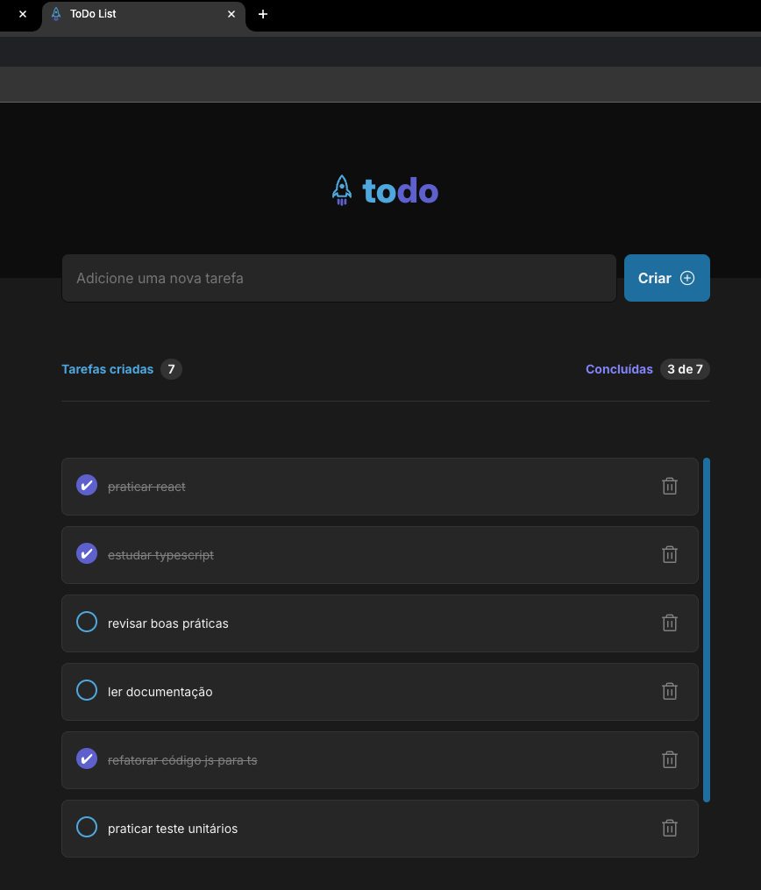

# To-Do List Application 
This project is a **To-Do List application**  developed using **React** , **TypeScript** , and **Vite** . The project is part of my learning journey in **Rocketseat's Ignite course** , where I'm expanding my skills in modern web development technologies. Although I started with a ready-made layout, I coded everything by myself, focusing on improving my knowledge of **TypeScript** .
## Features 

- Add new tasks to the list.

- Mark tasks as completed.

- Delete tasks.

- Track the number of tasks created and the number of tasks completed.

## Tech Stack 
 
- **React** : For building the user interface.
 
- **TypeScript** : To provide type safety and better code maintainability.
 
- **Vite** : A fast build tool that allows for an efficient development process.

## Live Demo
You can see the live version of this project [here](https://vitor-martini.github.io/to-do-list).

## Print Screen
